# Traffic control (tc)

## tc in Linux

In Linux, traffic control for shaping network flows is configured using the `tc` command. See details in [tc(8)](https://www.man7.org/linux/man-pages/man8/tc.8.html)

## shaping strategy in Oasis

<div align="center" style="text-align:center"> 
</div>
<div align="center">Fig 1.1 Traffic shaping strategy</div>

## tc example

Target:

- Limit the rate from `h0` to `h1` to 100Mbit/s
- For direction `h1` to `h0`, add 5% packet loss, 10ms delay.

Topology:

```bash
h0 (eth0) --- (eth0) h1
```

on host `h0`, set the rate limit on `eth0`:

```bash
tc qdisc add dev eth0 root handle 5: tbf rate 100.0Mbit burst 150kb latency 1ms
```

on host `h1`, we create an `ifb` interface `ifb0`:

```bash
ip link add name ifb0 type ifb
ip link set ifb0 up
```

Then, redirect the ingress ip traffic from `eth0` to `ifb0`:

```bash
tc qdisc add dev eth0 ingress
tc filter add dev h1-eth0 parent ffff: protocol ip u32 match u32 0 0 action mirred egress redirect dev ifb0
```

Finally, apply the traffic shaping(loss, delay, jitter) on `ifb0`:

```bash
tc qdisc add dev ifb0 root netem loss 5% delay 10ms limit 20000000
```

In order to have a better simulation result for latency, a larger buffer/queue size is preferred(specified by `limit 20000000` in tc command) otherwise tc will drop more packets when buffer is overwhelmed.

## tc_rules script

`./src/tools/tc_rules.sh` can be used to apply or unset the above tc rules for a topology H0-H1.

```bash
# run `tc_rules.sh eth0 set` on host H0 to apply the tc rules:
sudo ./src/tools/tc_rules.sh eth0 set

# run `tc_rules.sh eth0 set` on host H1 to apply the tc rules:
sudo ./src/tools/tc_rules.sh eth0 set
```

To unset the rules, run:

```bash
sudo ./src/tools/tc_rules.sh eth0 unset
```

## Matrix-to-link mapping in Oasis

Oasis uses the adjacency matrix to decide which physical links to create. The
link attribute matrices (`BW_MATRIX`, `LATENCY_MATRIX`, `LOSS_MATRIX`, and
`JITTER_MATRIX`) use the same host indexes: matrix cell `[i][j]` describes
traffic from host `i` toward host `j`, unless the topology is multi-homing as
described below.

### Non-multi-homing topology

For a normal topology, Oasis examines only the upper triangle of the
adjacency matrix to create physical links. For every `adj[i][j] == 1` where
`i < j`, it creates one link. The lower matrix cells do not create another
link; they configure the reverse direction on that same physical link.

| Traffic direction | Bandwidth | Ingress shaping |
| --- | --- | --- |
| `h{i} -> h{j}` | `BW[i][j]` | `LOSS[i][j]`, `LATENCY[i][j]`, `JITTER[i][j]` |
| `h{j} -> h{i}` | `BW[j][i]` | `LOSS[j][i]`, `LATENCY[j][i]`, `JITTER[j][i]` |

Example:

```text
adjacency = [[0, 1],
             [0, 0]]

BW        = [[0, 100],
             [50, 0]]
LATENCY   = [[0, 10],
             [10, 0]]
LOSS      = [[0, 0],
             [2, 0]]
```

This creates one `h0-h1` link. Its `h0 -> h1` egress rate is 100 Mbps and its
`h1 -> h0` egress rate is 50 Mbps. The reverse direction also receives 2%
loss. These are two traffic profiles on one physical link, not two links.

For linear topologies, `link_latency` describes the physical link's one-way
delay and is populated symmetrically in the latency matrix. Therefore a
configured 100 ms delay is applied in both directions and produces about
200 ms RTT.

### Multi-homing topology

Multi-homing uses a two-node symmetric adjacency matrix to represent two
parallel physical links:

```text
adjacency = [[0, 1],
             [1, 0]]
```

The upper-triangle entry creates the first link. The matching lower-triangle
entry creates the second link. In this mode, the two matrix cells identify the
two physical links; they are not opposite traffic directions.

Each physical link has one shared profile, applied symmetrically at both
endpoints:

| Physical link | Profile source | Applied to |
| --- | --- | --- |
| First link | path index 0 / upper triangle | both directions and both endpoints |
| Second link | path index 1 / lower triangle | both directions and both endpoints |

For example, with `rpath = 8 Mbps, 10 ms, 0%` and `dpath = 24 Mbps, 25 ms,
0%`, Oasis creates:

```text
h0-eth0 <---- 8 Mbps, 10 ms ----> h1-eth0
h0-eth1 <---- 24 Mbps, 25 ms ---> h1-eth1
```

The `tbf` rate and ingress `netem` parameters for each link are identical on
the two endpoint interfaces. Changing the `rpath` profile therefore changes
only the relay link; it does not change the direct link's attributes.
